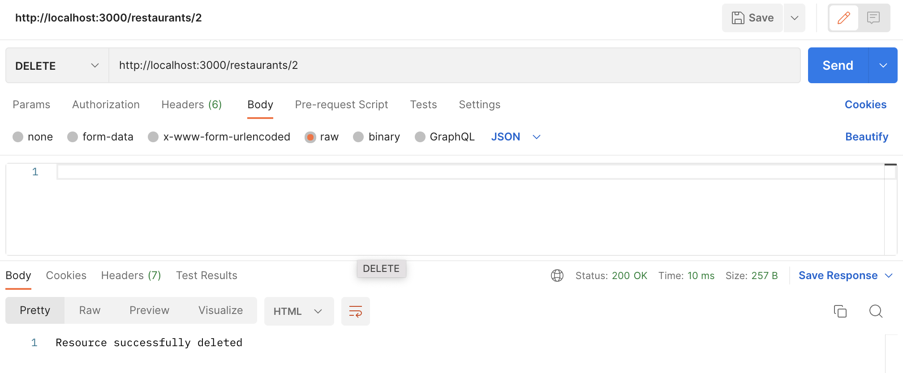

# Express Restaurants
Over the next series of lessons we will be building an application using Express that will be able to `GET`, `POST`, `PUT`, and `DELETE` values stored in a database. 

## Setup
After forking and cloning the repository, run the following (`npm run seed` runs the seed file):

```bash
npm install
npm run seed
npm start
```

## Part 1: `GET` Restaurants
1. In the `app.js` file, create a `GET` request using Express for the `/restaurants` endpoint
2. In the `GET` request, return all restaurants via the `Restaurant.findAll()` method. 
    - Remember to use `async` and `await`
    - Note that you will need to run `npm run seed` once in order to put data into the restaurant database.
3. Send the restaurants as a JSON Response (`res.json()`)
4. Test your endpoint by running `node server.js` and visiting http://localhost:3000/restaurants. Your response should look similar to the one shown below:


## Part 2: Route Parameters
1. In your `app.js` file, Use Express to create `GET /restaurants/:id` endpoint.
2. In `GET /restaurants/:id` get the id using the `req.params` object.
3. In `GET /restaurants/:id` get the particular restaurant via the method `findByPk()`.
4. Send the found restaurant as a JSON response (`res.json()`).
5. Start your server with `node server.js`.
5. Test your endpoint using Postman or your browser by sending a `GET` request to `http://localhost:3000/restaurants/1`. Your browser should output the following on Postman:


## Part 3: `POST`, `PUT`, and `DELETE` Restaurants
In `src/app.js`:
1. Call `app.use()` and pass it `express.json()` so that we can parse the request body that contain JSON objects.
2. Call `app.use()` and pass it `express.urlencoded()` so that we can parse the request body with urlencoded values.
2. Create an Express route for creating (adding) a new restaurant on your restaurant database.
3. Create an express route for updating (replacing) an existing restaurant with a new restaurant on your restaurant database based on ID in the route. 
    - For example, `restaurant/2` would update the restaurant with an ID of 2.
4. Create an express route for deleting (removing) a restaurant on your database based on the id in the route.
    - For example, `restaurant/2` would delete the restaurant with an ID of 2.
5. Test  your endpoints on Postman by making a `GET`, `POST`, `PUT`, and `DELETE` requests to http://localhost:3000/restaurants/

### Sending HTTP Requests with Postman

**`DELETE`**

`DELETE` requests typically do not have a request body. To send these requests in Postman:

1. Start the server using node server.js. 
2. Copy the URL (something like https://localhost:3000/restaurants/1) into Postman. 
3. Set the method to `DELETE`
4. Send the request. 
5. When you refresh the URL, you will see the value has been deleted.



**`PUT` and `POST`**

Creating and updating values with `POST` and `PUT` requests requires that we send information in the body of the HTTP request. To send these requests in Postman:

1. Set the method to `PUT` or `POST`
2. In Postman, select Body and then "raw". 
3. Paste the object into the body and ensure it is formatted correctly (i.e. JSON key values need to be in quotes).
4. Send the request
5. Refresh the page to see the updated array of values.


## Part 4: Express Router
1. Create a new directory for your express route(s)
2. Include a file within that directory to represent your express router
3. Define your express router to be able to handle creating, reading, updating, and deleting resources from your Restaurants database
4. Export your router
5. Include a reference to your router in your main express server
6. Use the express router in your main server
7. Remove any pre-defined routes from your main server and use only your express router.
8. Test your endpoints using Postman

## Part 5: Server Side Validation
1. Run `npm install express-validator` to install the Express Validator package
2. Include the check and `validationResult` methods from the Express Validator package in your Express Router for restaurants.
3. Navigate to your POST Request route to `/restaurants` from your Express Router and include a parameter `[]` in between the endpoint and the callback function. 
4. Within the array `[]` include a first item which checks that the “name” field in the `request.body` is not empty and doesn’t only contain whitespace
5. Within the array `[]` include a second item that checks that the “location” in the `request.body` is not empty and doesn’t only contain whitespace
6. Within the array `[]` include a third item that checks that the “cuisine” is the `request.body` is not empty and doesn’t only contain whitespace
7. Within the callback function, validate the results of your checks and store them in a variable named `errors`
8. Check that if the errors reference is not empty (there are errors), respond with a JSON that contains the key error and the value `errors.array()`
9. If the `errors` reference is empty (there are no errors), then continue with adding the restaurant to the Restaurant DB and return a list of all the restaurants including the newly added one.
10. Test your endpoint using Postman. Check to see if you can add a restaurant without any of the “name”, “location” or “cuisine” fields.
